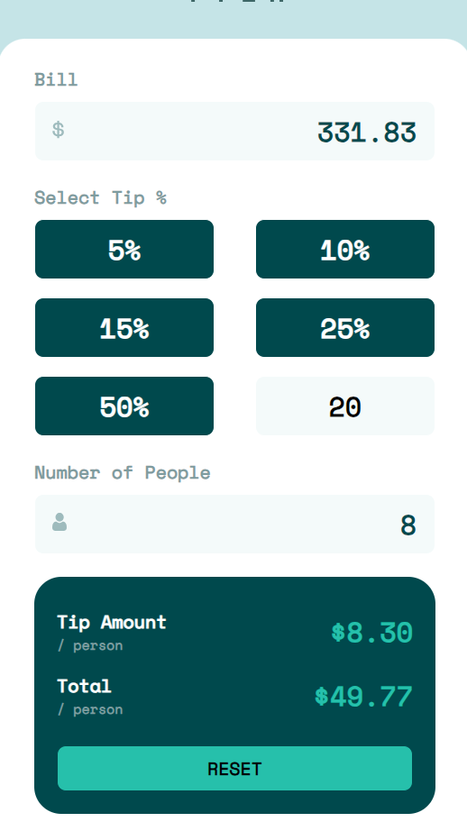
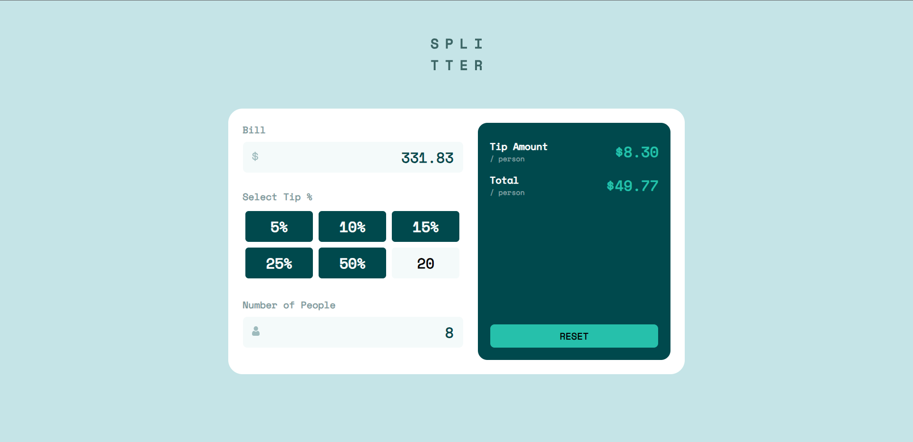

# Frontend Mentor - Tip calculator app solution

This is a solution to the [Tip calculator app challenge on Frontend Mentor](https://www.frontendmentor.io/challenges/tip-calculator-app-ugJNGbJUX). Frontend Mentor challenges help you improve your coding skills by building realistic projects.

## Table of contents

- [Overview](#overview)
  - [The challenge](#the-challenge)
  - [Screenshot](#screenshot)
  - [Links](#links)
- [My process](#my-process)
  - [Built with](#built-with)
  - [What I learned](#what-i-learned)
  - [Continued development](#continued-development)
  - [Useful resources](#useful-resources)
- [Author](#author)

## Overview

This is my submission for the Frontend Mentor Tip Calculator App. This app has a mobile and desktop version. The user inputs a bill total, selects or types in a custom tip amount, and enters a count a people to split the bill amongst. 

### The challenge

Users should be able to:

- View the optimal layout for the app depending on their device's screen size
- See hover states for all interactive elements on the page
- Calculate the correct tip and total cost of the bill per person

### Screenshot

Mobile Version:





### Links

- Live Site URL: [Add live site URL here](https://bmagana5.github.io/tip-calculator-app/)

## My process

I like building out the web page HTML "skeleton" out, first. Then, I gradually add CSS that gives elements dimension, positioning, and colors. Then, I like to add in different CSS styling for specific events like hover, active, focus, etc. Once I have this completed, I add in the React and JavaScript functionality and embed any state variables into the HTML hierarchy as needed.

### Built with

- Semantic HTML5 markup
- CSS custom properties
- Flexbox
- Mobile-first workflow
- [React](https://reactjs.org/) - JS library

### What I learned

In this challenge, I learned more about setting viewport width breakpoints. This is useful for making a web app functional in both mobile and desktop devices. 

Working with the input fields was the most challenging aspect of this project. I intended to use 
```html
<input type="number" onChange="handleInput"/>
```
at first, however whenever invalid input was detected, it was impossible to implement any error-handling/validation since the invalid input was removed from the event that was caught by the onchange handler. As a result, I had to make use of the <code>type="number"</code> variation of the input element and validate the input using a regular expression.

That code looked like this:

```js
switch (name) {
  /**/
  case 'bill':
      value = !value.match(/^\d*\.{0,1}\d{0,2}$/) ? bill : value;
      value === '' ?
          setBill('')
          : setBill(value);
      break;
  /**/
}
```

The regular expression checked if the input was a string that began with at least one digit, was followed by at most one period (.), and ended with at most 2 digits. This valid string was stored in a state hook variable and was then cast to a Number whenever it was needed.

### Continued development

My biggest take away from this challenge is using regular expressions. I learned about deriving a regex from finite-state automata in my undergrad CS studies, but I never actually really used them in any other capacity beside homework assignments. Relearning about regular expressions and using them to solve this problem truly made things feel a lot easier. I think I'd like to continue learning and using these more, as they could be used to quickly solve some problems that would otherwise be difficult through conventional solving attempts.

### Useful resources

- [W3Schools take on Regular Expressions](https://www.w3schools.com/jsref/jsref_obj_regexp.asp) - This helped me figure out how to write out the regular expression based on what I know I needed the valid string to look like. Excellent and concise guide.

## Author

Brian Magana
- Frontend Mentor - [@bmagana5](https://www.frontendmentor.io/profile/bmagana5)
